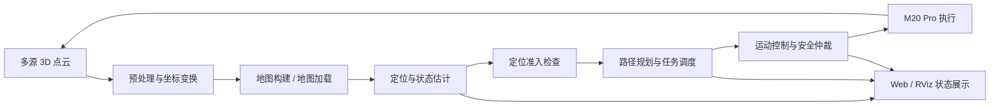
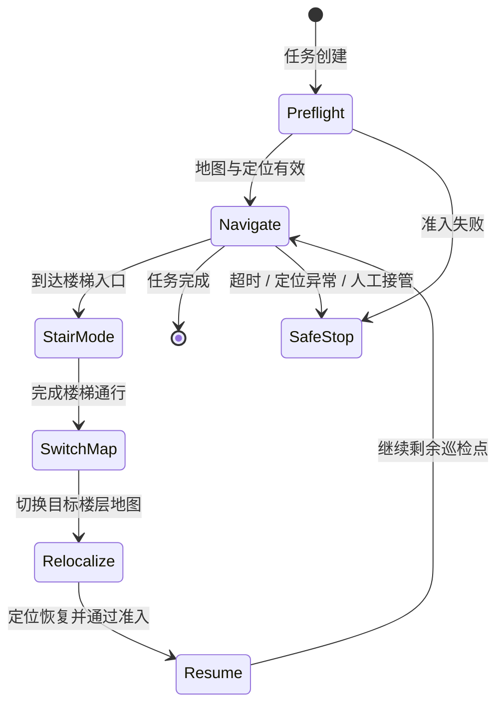

# M20 Pro 3D 自主导航与跨楼层巡检系统

  <strong>3D 建图定位 · 点云处理 · 自主导航 · 跨楼层任务 · Web 监理</strong>

  
  
  
  
  

面向园区与建筑巡检场景，从 0 到 1 构建 M20 Pro 机器人 3D 自主导航系统，打通点云感知、地图管理、定位准入、路径规划、运动控制、跨楼层任务和 Web 监理，形成“任务下发 → 自主执行 → 状态回传 → 异常接管”的完整工程闭环。

> 本仓库是面向招聘与技术交流的**脱敏项目展示页**。完整源码、机器人协议、地图与点云、模型文件、接口字段、网络配置及现场数据均未公开。

## 项目成果

| 方向 | 代表性成果 |
| --- | --- |
| 3D 建图与定位 | 融合多源点云、位姿与地图数据，建立地图加载、重定位和定位有效性准入链路 |
| 自主导航 | 对接 ROS 2 导航栈与机器人运动接口，完成路径规划、任务取消、超时保护和控制权仲裁 |
| 跨楼层巡检 | 使用状态机串联平地导航、楼梯步态、楼层地图切换、重新定位和任务续接 |
| 点云工程优化 | 将点云处理 CPU 占用由 `99.5%` 降至 `27%`，内存由 `2.27 GB` 降至 `610 MB` |
| 平台化交付 | 开发团队调试端与甲方交付端，提供任务编排、状态可视化、告警和远程接管能力 |
| 项目管理 | 负责技术路线、任务拆分、Git 协作与实习生带领，完成多轮客户和部委现场展示 |

## 3D 导航闭环

## 跨楼层任务流程

## 关键工程问题

### 1. 定位失效时如何阻止错误任务下发

任务创建、任务启动和地图切换不能共用一次静态检查。系统在关键状态转换处重新检查地图身份、定位状态、位姿时效和导航后端准备度；任一条件不满足时阻止目标进入运动链路，并保留人工重定位与安全接管入口。

### 2. 多个控制源如何避免同时抢占机器人

导航、楼梯步态、遥操作和急停统一经过控制权仲裁。高优先级安全事件可以使当前任务失效，清除未执行指令并切换到受控停止状态，避免过期动作在任务取消后继续执行。

### 3. 3D 点云为什么需要专门优化

高频点云的重复转换、序列化与前端传输会同时占用 CPU 和内存。项目通过降低无效复制、按用途拆分数据、控制更新频率并缓存可复用结果，使点云链路在保留导航与可视化能力的同时满足长期运行要求。

## 系统模块

| 模块 | 职责 |
| --- | --- |
| 感知与点云 | 多源点云接入、过滤、坐标变换与地图数据组织 |
| 地图与定位 | 地图资产、楼层身份、初始位姿、重定位和位姿稳定性检查 |
| 导航与任务 | 路径规划、航点任务、进度管理、取消、失败恢复与跨楼层状态机 |
| 控制安全 | 导航/遥操作仲裁、速度约束、超时保护、急停和任务失效机制 |
| 监理平台 | 地图、点云、路径、机器人状态、任务进度和告警可视化 |
| 巡检扩展 | 视觉检测、工业雷达测量与巡检结果汇总接口 |

## 与 VLA 项目的关系

本项目负责真实机器人导航、任务执行和安全控制；语言条件 ObjectNav 与多模态策略研究位于独立仓库：

- [M20 Pro 多模态 VLA 导航与具身控制](https://github.com/ghw1048040694/m20pro-vla)

两部分通过受控的高层任务/运动接口连接，VLA 策略不能绕过定位准入、控制仲裁和底层安全约束直接写入机器人执行器。

## 公开边界

为保护企业知识产权与现场安全，本展示仓库不包含：

- ROS 2 节点源码、机器人通信协议和可执行控制逻辑；
- 地图、点云、相机视频、巡检结果和运行日志；
- 模型权重、推理配置、类别文件和部署参数；
- API 字段、网络拓扑、服务器地址、令牌、证书和账号信息；
- 真实设备标定、速度/力矩限制和现场安全阈值。

如需了解具体实现，可在面试中结合系统架构、故障案例和工程取舍进行说明。

## 关键词

`ROS 2` · `3D Mapping` · `Localization` · `Nav2` · `Point Cloud` · `Multi-floor Navigation` · `Robot Safety` · `Web Supervision`
